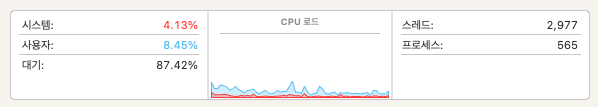
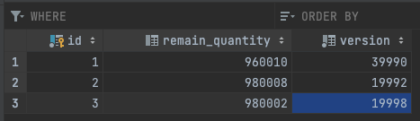
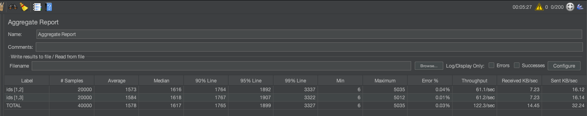
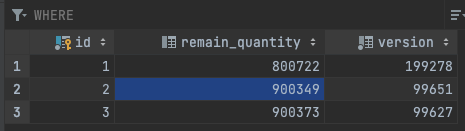

사양 : MacBook Pro(16인치, 2021년)
플랫폼 : macOS (ARM64 아키텍처)
CPU 사용률 : 12.58%

메모리 사용률 : 32.00GB 중 20.92GB 사용

MYSQL 설정 : mysql 8.0.32, REPEATABLE-READ
REDIS 설정 : redis 7.0.8

---
테스트 설정 : users: 200명, ramp-up: 10초, loop: 100회
에러율 : 10번의 락 획득 실패. [1,2] 2번 실패, [1,3] 8번 실패

성능 결과 : throughput 122.3개/초

---
테스트 설정 : users: 1000명, ramp-up: 10초, loop: 100회
에러율 : 722번의 락 획득 실패. [1,2] 349번 실패, [1,3] 373번 실패
성능 결과 : throughput 108.7개/초

