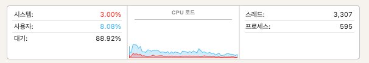
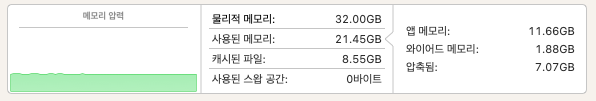
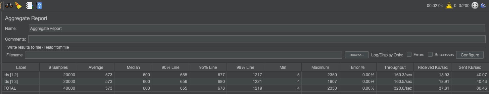
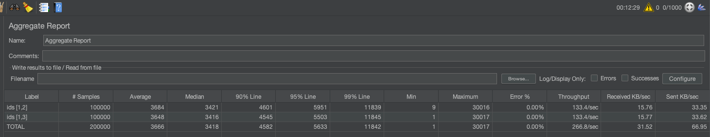
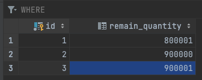

사양 : MacBook Pro(16인치, 2021년)
플랫폼 : macOS (ARM64 아키텍처)
CPU 사용률 : 11.08%

메모리 사용률 : 32.00GB 중 21.45GB 사용

MYSQL 설정 : mysql 8.0.32, REPEATABLE-READ
REDIS 설정 : redis 7.0.8

---
테스트 설정 : users: 200명, ramp-up: 10초, loop: 100회
에러율 : 0.00%
성능 결괴 : throughput 320.6개/초

---
테스트 설정 : users: 1000명, ramp-up: 10초, loop: 100회
에러율 : 0.00%
성능 결과 : throughput 266.8개/초

특이점 : 데이터 1개가 정합성이 안맞음

